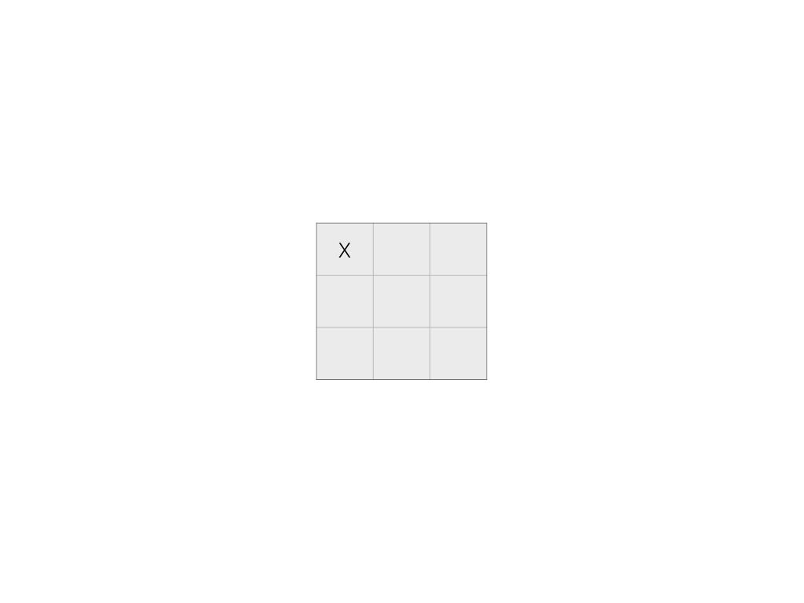
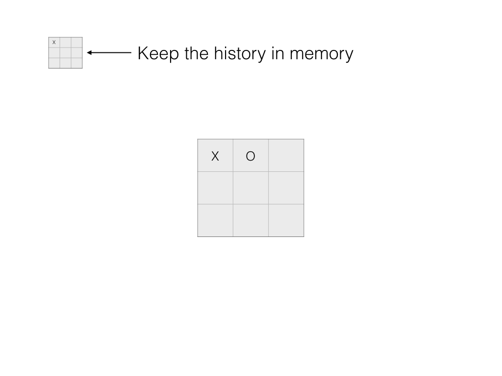
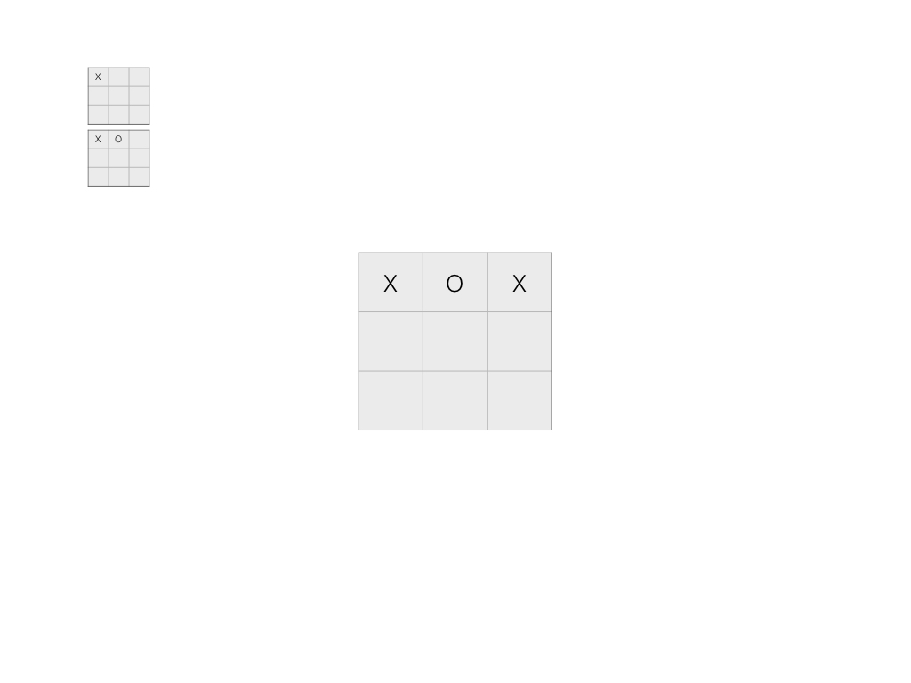
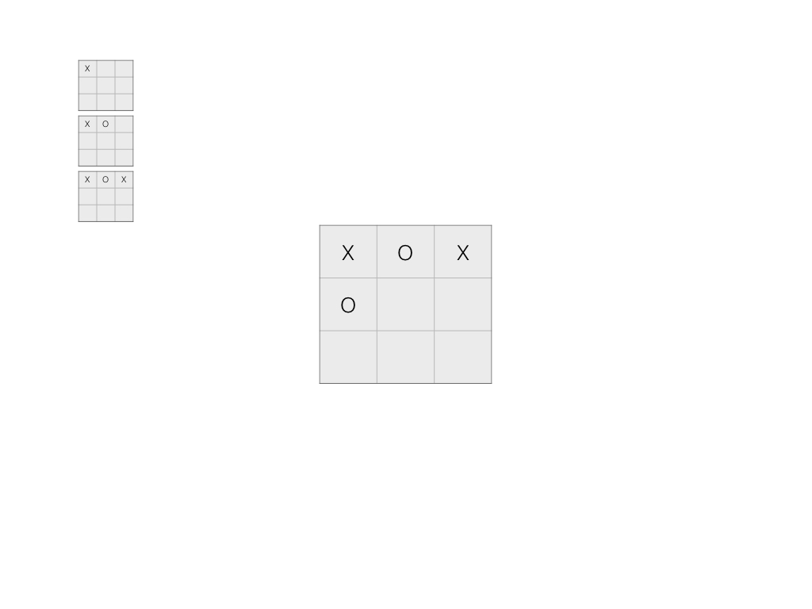
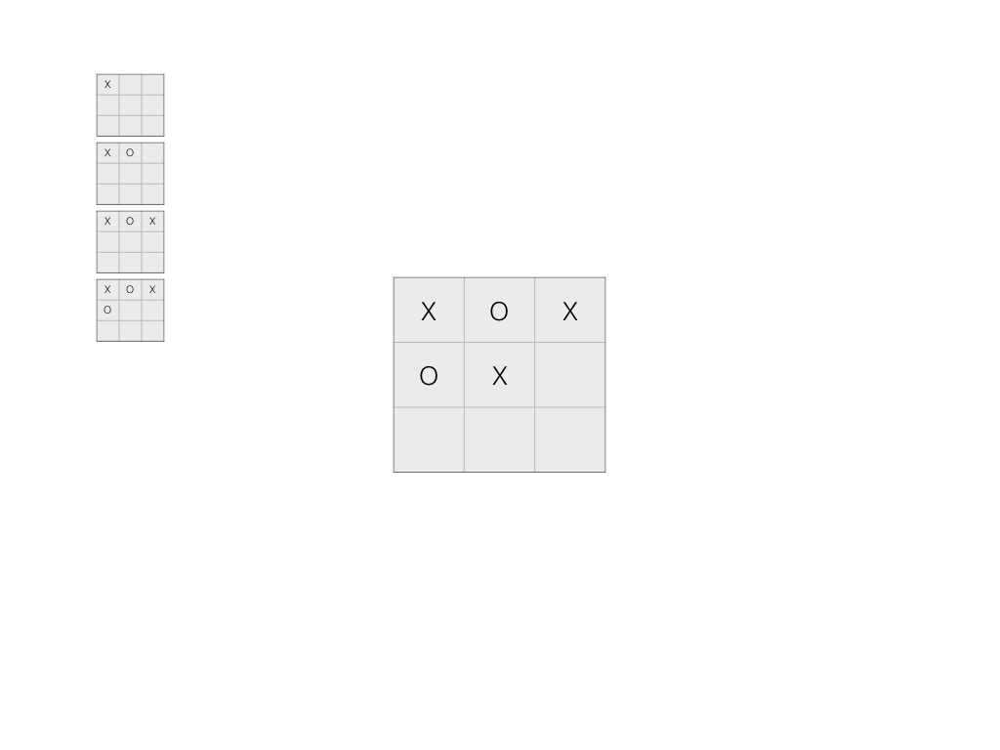
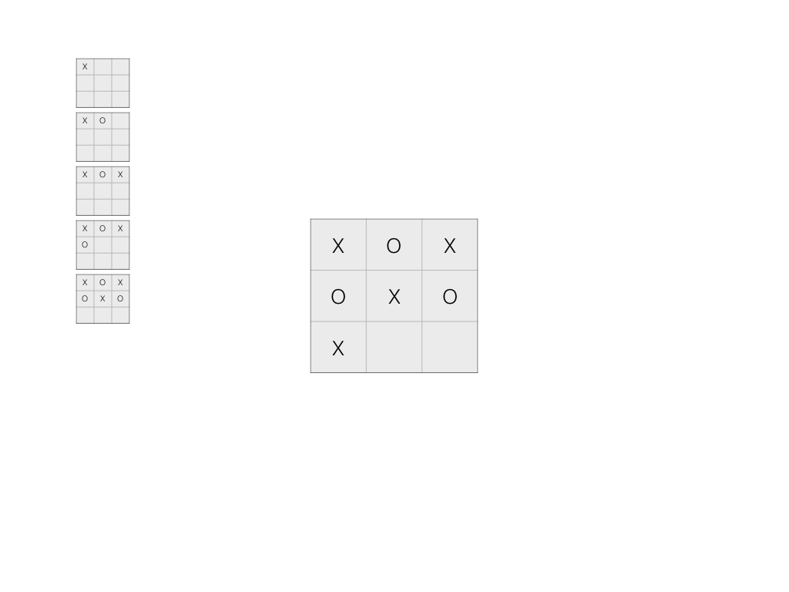
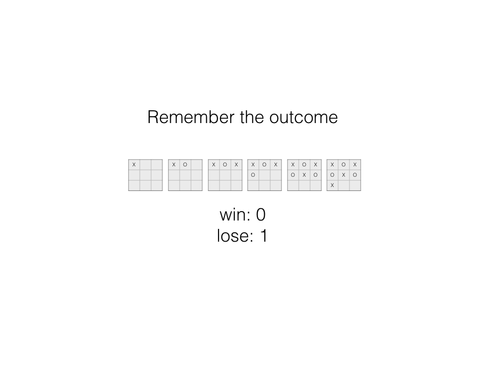
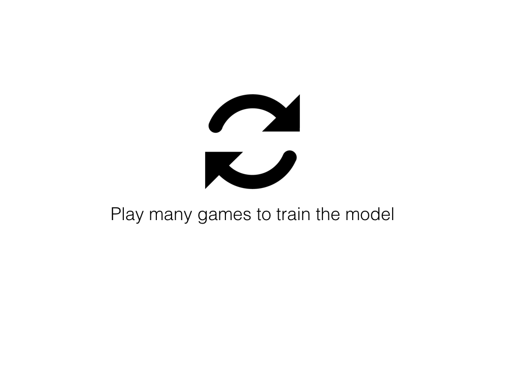
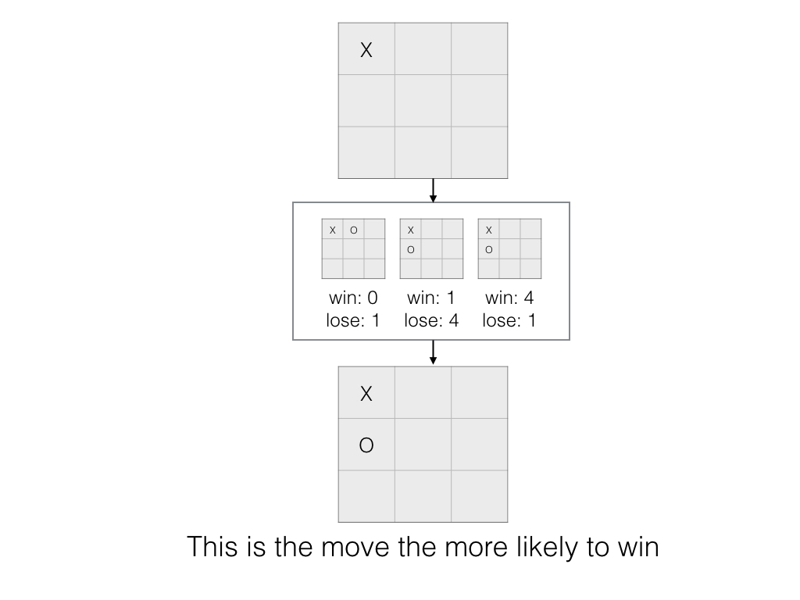

# AI for Tic Tac Toe

The algorithm keep previous games in memory.

When a game is finished, it looks at the outcome and assign it to each state.

Before playing, it loops through previous states and take the most likely to win move.

